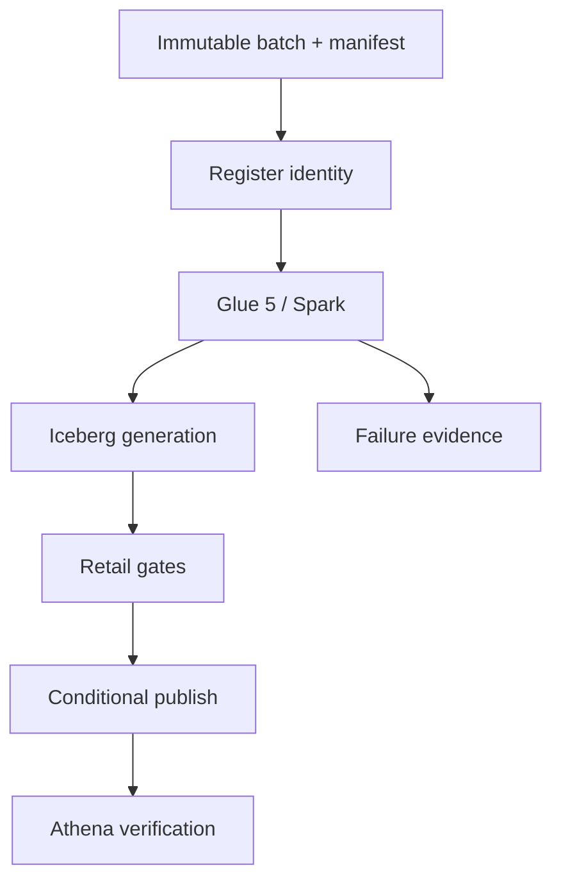

# AtlasRetail

**A failure-tested retail lakehouse that publishes a coherent business generation—not six
independently successful tables.**

[](https://github.com/bhuvaneshwaranmurugan21/atlasretail-lakehouse-platform/actions/workflows/ci.yml)
[](https://github.com/bhuvaneshwaranmurugan21/atlasretail-lakehouse-platform/actions/workflows/aws-oidc-identity.yml)

AtlasRetail models orders, lines, captures, refunds, inventory movements, and bitemporal product
versions. It proves idempotent ingestion, generation isolation, retail reconciliation, failure
rollback, stale-writer rejection, and controlled backfill publication locally. A manual AWS lab
executes the same control flow with Glue 5/Spark and Iceberg, Step Functions, DynamoDB, S3, Athena,
KMS, and CloudWatch, collects run evidence, and destroys every ephemeral resource.

## What is actually verified

| Claim | Status | Proof |
|---|---|---|
| Domain and manifest invariants | `LOCAL_VERIFIED` | 22 tests and a deterministic 14-check failure lab |
| Atomic multi-table publication model | `LOCAL_VERIFIED` | generation oracle, replay, rollback, and CAS tests |
| GitHub-to-AWS keyless identity | `AWS_VERIFIED` | identity-only workflow on `main` |
| Managed Glue/Iceberg execution | `DESIGNED` | becomes `AWS_VERIFIED` only after the bounded lab succeeds |
| Production scale or 24x7 operations | Not claimed | requires sustained workload and incident history |

The evidence boundary is intentional. See [the claim policy](docs/claims.md).

## Core invariants

- A batch ID is permanently bound to one canonical manifest digest.
- Replaying the same ID and digest has one business effect; changing content under that ID fails.
- A generation is invisible until all six datasets pass cross-table reconciliation.
- `total = subtotal + tax - discount`; captures cover completed orders; refunds never exceed capture.
- Returned quantity never exceeds ordered quantity; cumulative product/store inventory never goes
  below zero.
- Product dimensions resolve by both event time and knowledge time; a late unknowable version is
  quarantined.
- Publication advances one DynamoDB pointer version with compare-and-swap; stale publishers fail.
- A backfill is an isolated generation and cannot implicitly replace the active serving state.

## Architecture



Iceberg makes a table snapshot atomic; it does not make six retail table commits one transaction.
The additional generation pointer closes that business-consistency gap. The full reasoning is in
[Architecture](docs/architecture.md) and [ADR 0001](docs/adr/0001-generation-publication.md).

## Run locally

Python 3.11+ is required. The correctness kernel itself has no runtime dependencies.

```bash
python -m pip install -e '.[dev]'
pytest
atlasretail simulate --output /tmp/atlasretail-evidence.json
atlasretail generate --output /tmp/atlasretail-input --orders 1000 --batch-id demo-001
```

The committed [local evidence](evidence/local/failure-lab.json) is deterministic. CI regenerates it
and fails on any unexplained diff.

## Run the bounded AWS proof

The AWS workflow is manual because cloud execution is evidence work, not a CI side effect.

1. Attach [the scoped role policy](infra/iam/atlasretail-github-role-policy.json) to
   `AtlasRetailGitHubOidcRole`. Do not change its repository-and-main-only OIDC trust.
2. Run **Shared AWS foundation** once with the $20 default budget.
3. Run **AWS bounded lab** with 1,000 orders and confirmation `DESTROY`.
4. Download the evidence artifact and confirm `summary.json` and `teardown.json` both say `PASS`.
5. Do not raise the 10,000-order hard limit until the baseline cost and runtime are reviewed.

The workflow checks account `887720497919` and region `ap-south-1`, acquires a three-hour
account-wide lease, proves a clean backend, and machine-validates a saved create-only plan. It uses
remote locked state, runs success/replay/failure/recovery scenarios, validates exact Athena
business totals, exports CloudWatch events, and limits Athena scans to 1 GiB per query. A separate
always-running job validates and applies a saved destroy-only plan so deployment-job failure cannot
skip cleanup. The detailed operator procedure is in the [runbook](docs/runbook.md).

## Repository map

| Path | Purpose |
|---|---|
| `src/atlasretail` | Dependency-free domain, contracts, quality gates, and publication oracle |
| `tests` | Behavioural tests for invariants, replay, conflicts, rollback, and recovery |
| `contracts` | Versioned batch-manifest JSON Schema |
| `aws/glue` | Real Glue 5/Spark Iceberg transformation and reconciliation job |
| `aws/lambda` | DynamoDB registration and compare-and-swap publication control plane |
| `infra/foundation` | Shared state, locks, and budget CloudFormation stack |
| `infra/atlas` | Ephemeral, run-tagged Terraform deployment |
| `scripts` | Locking, execution polling, evidence summary, and teardown verification |
| `evidence` | Honest local proof and placeholders for immutable AWS run evidence |
| `INTERVIEW.md` | Design defense, trade-offs, limitations, and expected questions |

## Design limits

This is a deliberately bounded engineering lab, not a claim of PCI compliance, petabyte scale,
multi-region DR, or production tenure. The [threat model](docs/threat-model.md),
[cost model](docs/cost-model.md), and [interview defense](INTERVIEW.md) state what is controlled and
what remains outside the proof.

## License

MIT
