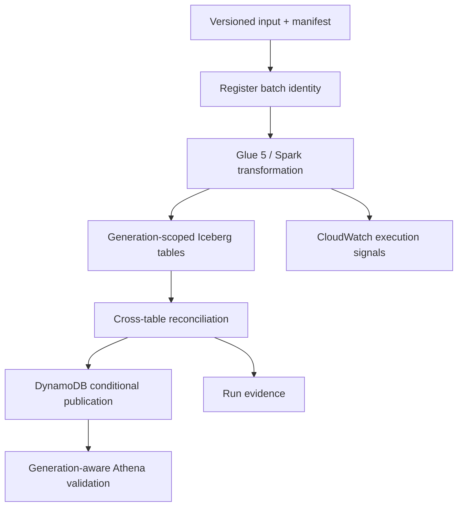

# AtlasRetail

**A generation-consistent retail lakehouse for publishing one coherent business state across
orders, payments, returns, inventory, and product dimensions.**

[](https://github.com/bhuvaneshwaranmurugan21/atlasretail-lakehouse-platform/actions/workflows/ci.yml)
[](https://github.com/bhuvaneshwaranmurugan21/atlasretail-lakehouse-platform/actions/workflows/aws-oidc-identity.yml)

AtlasRetail separates generation construction from publication. Six independently valid Iceberg
table commits can still represent an inconsistent retail state; the platform therefore builds an
isolated generation, applies cross-table reconciliation, and conditionally advances a single
active-generation pointer only after the complete generation passes validation.

## System behaviour

- Bind a batch identifier to one canonical manifest digest.
- Treat an identical redelivery as idempotent and reject conflicting content reuse.
- Write orders, lines, payments, returns, inventory movements, and products by generation.
- Reconcile financial equations, captured payments, refunds, return quantities, inventory, and
  bitemporal product resolution before publication.
- Advance the DynamoDB active-generation pointer with compare-and-swap semantics.
- Prevent failed, incomplete, stale, or unapproved backfill generations from becoming active.
- Retain attributable execution evidence and independently verify infrastructure teardown.

The detailed rules and current enforcement boundaries are in the
[correctness model](docs/correctness.md).

## Architecture



Iceberg provides atomic table snapshots, schema evolution, partition evolution, and time travel.
AtlasRetail adds a publication control plane because table-level atomicity does not provide one
transaction across six business tables. See the [architecture](docs/architecture.md),
[generation-publication ADR](docs/adr/0001-generation-publication.md), and
[manifest-identity ADR](docs/adr/0002-manifest-identity.md).

## Components

| Path | Responsibility |
|---|---|
| `src/atlasretail` | Domain model, deterministic generator, manifest logic, quality gates, and local publication model |
| `contracts` | Versioned batch-manifest JSON Schema |
| `aws/glue` | Glue 5 / Spark transformation and Iceberg writes |
| `aws/lambda` | DynamoDB batch registration and conditional publication |
| `infra/foundation` | Shared Terraform state, account lease, and cost budget |
| `infra/atlas` | Ephemeral, run-tagged AtlasRetail infrastructure |
| `scripts` | Preflight, execution polling, plan validation, evidence summary, and teardown verification |
| `tests` | Behavioural and infrastructure-contract tests |
| `evidence` | Reproducible local results and managed-environment operation records |

## Run locally

Python 3.11 or later is required. The correctness kernel has no runtime dependencies.

```bash
python -m pip install -e '.[dev]'
pytest
atlasretail simulate --output /tmp/atlasretail-evidence.json
atlasretail generate --output /tmp/atlasretail-input --orders 1000 --batch-id demo-001
```

CI regenerates [the deterministic local evidence](evidence/local/failure-lab.json) and rejects an
unexplained diff.

## Verification status

| Capability | Status | Evidence |
|---|---|---|
| Domain, manifest, and retail invariants | `LOCAL_VERIFIED` | Automated tests and deterministic failure scenarios |
| Generation isolation, replay, rollback, and stale-writer rejection | `LOCAL_VERIFIED` | Local publication model and behavioural tests |
| GitHub-to-AWS keyless identity | `AWS_VERIFIED` | Identity-only workflow on `main` |
| Saved-plan deployment and exact-state teardown controls | `AWS_VERIFIED` | Recorded partial deployments and successful rescue teardown |
| Managed Glue and Iceberg transformation | `NOT_YET_VERIFIED` | AWS Free-plan service access prevented Glue job creation |
| Managed replay, injected failure, recovery, and Athena validation | `NOT_YET_VERIFIED` | The data-processing portion of the AWS workflow has not run |
| Runtime, throughput, and settled cost | `NOT_YET_MEASURED` | Requires a successful managed execution |
| Sustained production operation | `OUT_OF_SCOPE` | No long-running workload or operational-tenure claim |

Verification levels and evidence-handling rules are defined in
[docs/verification.md](docs/verification.md). Operational history is indexed in
[evidence/README.md](evidence/README.md).

## AWS validation environment

The manual AWS workflow is an ephemeral validation environment, not a continuous deployment path.
It is bounded to account `887720497919`, region `ap-south-1`, a small synthetic workload, a saved
Terraform plan, and mandatory teardown.

Before execution:

1. Confirm that the AWS account plan permits Glue job creation.
2. Attach [the checked-in role policy](infra/iam/atlasretail-github-role-policy.json) to
   `AtlasRetailGitHubOidcRole` without broadening the repository-and-branch OIDC trust.
3. Require a successful read-only preflight and an empty Atlas Terraform state.
4. Begin with 1,000 orders; do not raise the workload bound until the baseline is reviewed.
5. Require both the execution summary and independent teardown report to pass.

The complete procedure and stop conditions are in the [AWS runbook](docs/runbook.md).

## Scope and non-goals

AtlasRetail currently targets a single-region, synthetic-data validation environment. It does not
establish PCI DSS compliance, personal-data controls, multi-region disaster recovery, continuous
petabyte throughput, or staffed 24x7 operation. The active-generation pointer is implemented in
the control plane, but a complete analyst-facing serving resolver is not yet implemented; raw
physical tables must not be treated as the published interface.

See the [threat model](docs/threat-model.md), [cost model](docs/cost-model.md), and
[correctness model](docs/correctness.md) for the remaining boundaries.

## License

MIT
