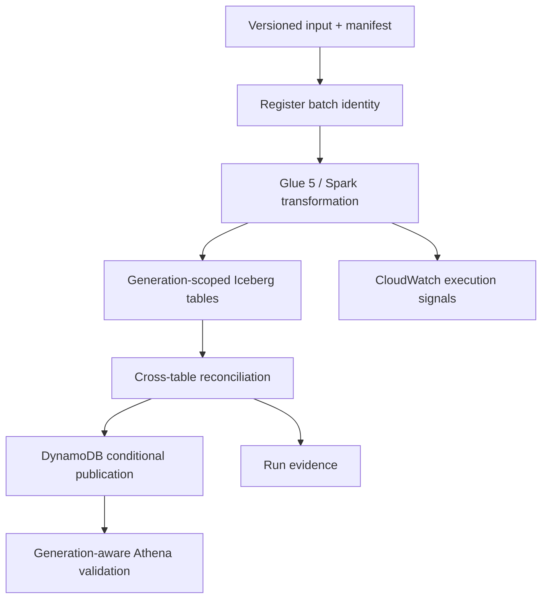

# AtlasRetail

**A generation-consistent retail lakehouse for publishing one coherent business state across
orders, payments, returns, inventory, and product dimensions.**

[](https://github.com/bhuvaneshwaranmurugan21/atlasretail-lakehouse-platform/actions/workflows/ci.yml)
[](https://github.com/bhuvaneshwaranmurugan21/atlasretail-lakehouse-platform/actions/workflows/aws-oidc-identity.yml)
[](https://github.com/bhuvaneshwaranmurugan21/atlasretail-lakehouse-platform/actions/workflows/aws-plan-only.yml)

AtlasRetail separates generation construction from publication. Six independently valid Iceberg
table commits can still represent an inconsistent retail state; the platform therefore builds an
isolated generation, applies cross-table reconciliation, and conditionally advances a single
active-generation pointer only after the complete generation passes validation.

## System behaviour

- Bind a batch identifier to one canonical manifest digest.
- Bind every managed input to an exact S3 key, version, byte count, ETag, and SHA-256 checksum.
- Recompute every ordered table digest before upload and independently inside the Glue job.
- Treat an identical redelivery as idempotent and reject conflicting content reuse.
- Write orders, lines, payments, returns, inventory movements, and products by generation.
- Reconcile financial equations, captured payments, refunds, return quantities, inventory, and
  bitemporal product resolution before publication.
- Advance the DynamoDB active-generation pointer with compare-and-swap semantics.
- Resolve the active generation once before constructing a six-table serving query.
- Prevent failed, incomplete, stale, or unapproved backfill generations from becoming active.
- Retain attributable execution evidence and independently verify infrastructure teardown.

The detailed rules and current enforcement boundaries are in the
[correctness model](docs/correctness.md).

## Architecture



Iceberg provides atomic table snapshots, schema evolution, partition evolution, and time travel.
AtlasRetail adds a publication control plane because table-level atomicity does not provide one
transaction across six business tables. See the [architecture](docs/architecture.md),
[generation-publication ADR](docs/adr/0001-generation-publication.md), and
[manifest-identity ADR](docs/adr/0002-manifest-identity.md).

## Components

| Path | Responsibility |
|---|---|
| `src/atlasretail` | Domain model, deterministic generator, manifest logic, quality gates, and local publication model |
| `contracts` | Versioned batch-manifest JSON Schema |
| `aws/glue` | Glue 5 / Spark transformation and Iceberg writes |
| `aws/lambda` | DynamoDB batch registration and conditional publication |
| `infra/foundation` | Shared Terraform state, account lease, and cost budget |
| `infra/iam` | Canonical OIDC trust and bounded inline-role policy contracts |
| `infra/atlas` | Ephemeral, run-tagged AtlasRetail infrastructure |
| `scripts` | Preflight, execution polling, plan validation, evidence summary, and teardown verification |
| `tests` | Behavioural, invariant-parity, immutable-input, and infrastructure-contract tests |
| `tests/integration` | Executable Glue 5 / Spark 3.5.4 / Iceberg 1.7.1 transformation proof |
| `evidence` | Reproducible local results and managed-environment operation records |

## Run locally

Python 3.11 or later is required. The correctness kernel has no runtime dependencies.

```bash
python -m pip install -e '.[dev]'
pytest
atlasretail simulate --output /tmp/atlasretail-evidence.json
atlasretail generate --output /tmp/atlasretail-input --orders 1000 --batch-id demo-001
```

CI regenerates [the deterministic local evidence](evidence/local/failure-lab.json) and rejects an
unexplained diff.

The separate runtime-integration CI job pins the AWS Glue 5 runtime versions: Python 3.11,
Spark 3.5.4, and the SHA-512-verified Iceberg 1.7.1 runtime. No AWS credentials are configured. It
executes the production Spark transformation against a local Iceberg catalog, verifies all six
physical snapshots, rejects invalid retail inputs, and proves same-generation replay and
injected-failure recovery. This is runtime-compatible local evidence; it is not a managed AWS
execution.

## Verification status

| Capability | Status | Evidence |
|---|---|---|
| Domain, immutable-object manifest, and retail invariants | `LOCAL_VERIFIED` | Automated tests and deterministic failure scenarios |
| Managed lifecycle, recovery, serving resolver, and stale-writer rejection | `LOCAL_VERIFIED` | Control-plane, resolver, and infrastructure-contract tests |
| Glue 5-compatible Spark transformation and real local Iceberg snapshots | `LOCAL_VERIFIED` | Pinned Glue 5-compatible integration job with isolated Hadoop catalog |
| GitHub-to-AWS keyless identity | `AWS_VERIFIED` | Identity-only workflow on `main` in the current target |
| Current-target IAM and foundation safety baseline | `AWS_VERIFIED` | [Run 32926893305](https://github.com/bhuvaneshwaranmurugan21/atlasretail-lakehouse-platform/actions/runs/32926893305) proved exact live IAM parity, the hardened persistent foundation, lease safety, budget alerts, an empty backend, and zero workload resources |
| Current-target budget, create-only plan, and zero-change proof | `NOT_YET_VERIFIED` | Plan-only workflow remains blocked until the foundation is AWS-verified |
| Current-target saved-plan deployment and exact-state teardown | `NOT_YET_VERIFIED` | Controls are locally tested; no deployment has run in the current target |
| Managed Glue and Iceberg transformation | `NOT_YET_VERIFIED` | Runtime-compatible local execution passes; the AWS-managed workload has not run |
| Managed replay, conflict, object tamper, failure, recovery, and Athena validation | `NOT_YET_VERIFIED` | Requires the bounded AWS execution |
| Runtime, throughput, and settled cost | `NOT_YET_MEASURED` | Requires a successful managed execution |
| Sustained production operation | `OUT_OF_SCOPE` | No long-running workload or operational-tenure claim |

Verification levels and evidence-handling rules are defined in
[docs/verification.md](docs/verification.md). Operational history is indexed in
[evidence/README.md](evidence/README.md).

## AWS validation environment

The checked-in [AWS target](.github/atlas-target.json) binds the active repository to account
`857229544428`, region `ap-southeast-2`, and the repository-specific OIDC role. The managed
workflows are manual, bounded validation paths rather than continuous deployment. Historical
plan, deployment, and rescue evidence belongs to the previous environment and does not verify the
current target.

Before execution:

1. Require the plan-only proof to verify live IAM parity, an empty baseline, a create-only resource
   envelope, the planned Step Functions definition, and an unchanged post-plan inventory.
2. Require the read-only account-plan gate to record `PAID` and `ACTIVE` when AWS exposes a plan
   record. Organization member accounts with no plan record must return the exact AWS
   `ResourceNotFoundException` and present current, account-bound organization-shared credit for
   the bounded run ceiling.
3. Attach [the checked-in role policy](infra/iam/atlasretail-github-role-policy.json) to
   `AtlasRetailGitHubOidcRole`, preserve the
   [canonical trust contract](infra/iam/atlasretail-github-role-trust-policy.json), and run the
   independent IAM baseline verifier.
4. Require a successful read-only preflight and an empty Atlas Terraform state.
5. Begin with 500 orders; the workflow enforces a maximum of 2,000 per managed scenario.
6. Require both the execution summary and independent teardown report to pass.

The complete procedure and stop conditions are in the [AWS runbook](docs/runbook.md).

## Scope and non-goals

AtlasRetail currently targets a single-region, synthetic-data validation environment. It does not
establish PCI DSS compliance, personal-data controls, multi-region disaster recovery, continuous
petabyte throughput, or staffed 24x7 operation. The resolver provides a generation-pinned query
boundary, but it does not prevent a principal with direct physical-table access from bypassing that
boundary. Raw physical tables are therefore storage interfaces, not published data products.

See the [threat model](docs/threat-model.md), [cost model](docs/cost-model.md), and
[correctness model](docs/correctness.md) for the remaining boundaries.

## License

MIT
