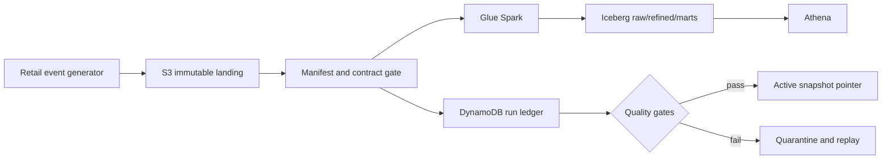

# AtlasRetail — Quality-Gated Retail Lakehouse

[](https://github.com/bhuvaneshwaranmurugan21/atlasretail-lakehouse-platform/actions/workflows/ci.yml)

AtlasRetail is a correctness-first reference platform for omnichannel orders, returns, and
inventory. It uses immutable input manifests and Apache Iceberg snapshots so a late arrival,
failed backfill, or duplicate batch cannot silently replace the active analytical product.

## Architecture opinion

Medallion layers are not a correctness guarantee. AtlasRetail publishes one proven retail
snapshot only after contract, replay, financial, inventory, and quality gates pass.



## Demonstrated locally

- atomic batch application and identical replay;
- conflicting replay rejection;
- refund-not-above-capture and non-negative inventory invariants;
- schema blocking, injected pre-commit failure, and rollback;
- quality-gated compare-and-swap publication;
- isolated backfills that cannot change the active snapshot.

The AWS topology is defined in Terraform but is not claimed as executed until an evidence
bundle contains real Glue run IDs, Athena query IDs, Iceberg snapshot IDs, cost, recovery, and
teardown proof. See `docs/claims.yaml`.

## Run locally

```bash
python -m venv .venv
source .venv/bin/activate
python -m pip install -e '.[dev]'
make check
make evidence
```

## Interview path

Explain why a successful ETL job does not prove a trustworthy retail snapshot. Then show the
refund, inventory, replay, backfill, and pointer invariants before discussing AWS services.

