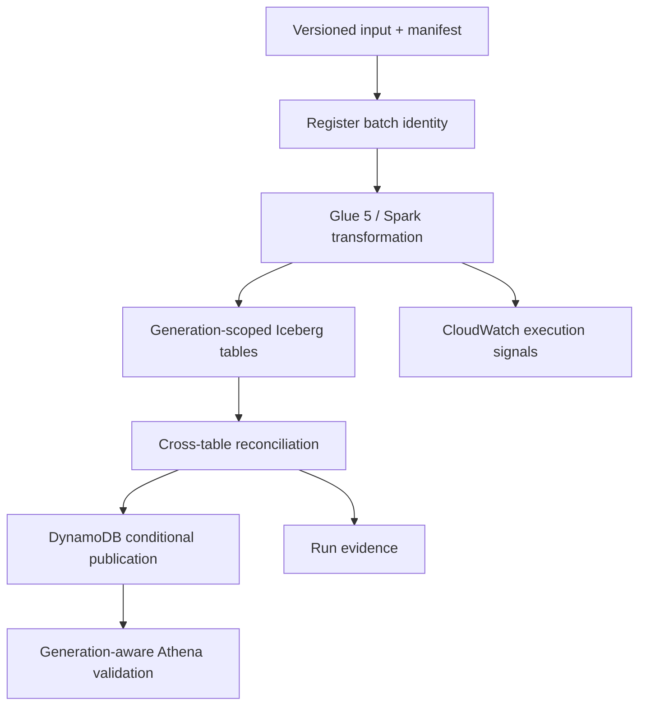

# AtlasRetail

**A generation-consistent retail lakehouse for publishing one coherent business state across
orders, payments, returns, inventory, and product dimensions.**

[](https://github.com/bhuvaneshwaranmurugan21/atlasretail-lakehouse-platform/actions/workflows/ci.yml)
[](https://github.com/bhuvaneshwaranmurugan21/atlasretail-lakehouse-platform/actions/workflows/aws-oidc-identity.yml)
[](https://github.com/bhuvaneshwaranmurugan21/atlasretail-lakehouse-platform/actions/workflows/aws-plan-only.yml)

AtlasRetail separates generation construction from publication. Six independently valid Iceberg
table commits can still represent an inconsistent retail state; the platform therefore builds an
isolated generation, applies cross-table reconciliation, and conditionally advances a single
active-generation pointer only after the complete generation passes validation.

## System behaviour

- Bind a batch identifier to one canonical manifest digest.
- Bind every bounded source to its generator parameters, source commit, schemas, logical digests,
  deterministic gzip bytes, and independently validated provenance receipt.
- Admit the exact operator, run attempt, confirmations, bounded cost, and complete source-byte tree
  before either execution or teardown can request AWS credentials.
- Bind every managed input to an exact S3 key, version, byte count, ETag, and SHA-256 checksum.
- Recompute every ordered table digest before upload and independently inside the Glue job.
- Treat an identical redelivery as idempotent and reject conflicting content reuse.
- Write orders, lines, payments, returns, inventory movements, and products by generation.
- Reconcile financial equations, captured payments, refunds, return quantities, inventory, and
  bitemporal product resolution before publication.
- Advance the DynamoDB active-generation pointer with compare-and-swap semantics.
- Resolve the active generation once before constructing a six-table serving query.
- Prevent failed, incomplete, stale, or unapproved backfill generations from becoming active.
- Retain attributable execution evidence and independently verify infrastructure teardown.

The detailed rules and current enforcement boundaries are in the
[correctness model](docs/correctness.md).

## Architecture



Iceberg provides atomic table snapshots, schema evolution, partition evolution, and time travel.
AtlasRetail adds a publication control plane because table-level atomicity does not provide one
transaction across six business tables. See the [architecture](docs/architecture.md),
[generation-publication ADR](docs/adr/0001-generation-publication.md), and
[manifest-identity ADR](docs/adr/0002-manifest-identity.md). Part 4 source and dispatch boundaries
are recorded in the [source-provenance ADR](docs/adr/0003-source-provenance.md) and
[pre-AWS admission ADR](docs/adr/0004-pre-aws-admission.md). The
[contract-complete evidence ADR](docs/adr/0005-contract-complete-evidence-finality.md) and
[immutable teardown-authority ADR](docs/adr/0006-immutable-teardown-authority.md) define final
evidence and recovery.

## Components

| Path | Responsibility |
|---|---|
| `src/atlasretail` | Domain model, deterministic generator, manifest logic, quality gates, and local publication model |
| `contracts` | Versioned batch-manifest, execution, and source-provenance contracts |
| `aws/glue` | Glue 5 / Spark transformation and Iceberg writes |
| `aws/lambda` | DynamoDB batch registration and conditional publication |
| `infra/foundation` | Shared Terraform state, account lease, and cost budget |
| `infra/iam` | Canonical OIDC trust and bounded inline-role policy contracts |
| `infra/atlas` | Ephemeral, run-tagged AtlasRetail infrastructure |
| `scripts` | Preflight, execution polling, plan validation, evidence summary, and teardown verification |
| `tests` | Behavioural, invariant-parity, immutable-input, and infrastructure-contract tests |
| `tests/integration` | Executable Glue 5 / Spark 3.5.4 / Iceberg 1.7.1 transformation proof |
| `evidence` | Reproducible local results and managed-environment operation records |

## Run locally

Python 3.11 or later is required. The correctness kernel has no runtime dependencies.

```bash
python -m pip install -e '.[dev]'
pytest
atlasretail simulate --output /tmp/atlasretail-evidence.json
atlasretail generate --output /tmp/atlasretail-input --orders 1000 --batch-id demo-001
atlasretail generate-sources --output /tmp/atlasretail-part4-sources --orders 500 \
  --source-commit "$(git rev-parse HEAD)" --run-id local-proof
python scripts/validate_part4_sources.py --directory /tmp/atlasretail-part4-sources
python scripts/validate_part4_admission_controls.py
python scripts/validate_part4_stage4_controls.py
python scripts/validate_part4_stage5_controls.py
```

CI regenerates [the deterministic local evidence](evidence/local/failure-lab.json) and rejects an
unexplained diff.

The separate runtime-integration CI job pins the AWS Glue 5 runtime versions: Python 3.11,
Spark 3.5.4, and the SHA-512-verified Iceberg 1.7.1 runtime. No AWS credentials are configured. It
executes the production Spark transformation against a local Iceberg catalog, verifies all six
physical snapshots, rejects invalid retail inputs, and proves same-generation replay and
injected-failure recovery. This is runtime-compatible local evidence; it is not a managed AWS
execution.

## Verification status

| Capability | Status | Evidence |
|---|---|---|
| Domain, immutable-object manifest, and retail invariants | `LOCAL_VERIFIED` | Automated tests and deterministic failure scenarios |
| Managed lifecycle, recovery, serving resolver, and stale-writer rejection | `LOCAL_VERIFIED` | Control-plane, resolver, and infrastructure-contract tests |
| Part 4 deterministic source provenance | `LOCAL_VERIFIED` | Contract-bound five-family source materialization, strict receipts, byte-for-byte CI reproduction, and tamper evidence |
| Part 4 pre-AWS admission controls | `LOCAL_VERIFIED` | Exact operator, ref, run-attempt, confirmation, bound and source-tree admission; independent pre-OIDC revalidation; clean-only lease release |
| Part 4 contract-complete evidence readiness | `LOCAL_VERIFIED` | Two-phase semantic checkpoint/finalizer, all 20 contract domains and 18 provenance fields, session isolation, adversarial mutation tests, teardown and consistent-read lease finality |
| Part 4 immutable teardown authority and deterministic recovery | `LOCAL_VERIFIED` | Attempt/source/plan-bound authority, immutable artifact identity, conditional lease state machine, cleanup-only manual recovery, saved destroy-plan integrity, and adversarial CI proof; no Stage 5 AWS run |
| Part 4 Stage 6 managed execution and finality | `AWS_VERIFIED` | [Run 33329861907](https://github.com/bhuvaneshwaranmurugan21/atlasretail-lakehouse-platform/actions/runs/33329861907) admitted exact current-source prerequisites, passed all 20 contract domains, finalized only after exact teardown and lease release, and was followed by independent clean-state run 33331233341 |
| Part 4 Stage 7 durable closure | `LOCAL_VERIFIED` | A strict deterministic receipt authenticates the Stage 6 workload and recovery authorities, proves the 107-file managed surface remains runtime-equivalent, and binds fresh read-only clean inventory [run 33364428199](https://github.com/bhuvaneshwaranmurugan21/atlasretail-lakehouse-platform/actions/runs/33364428199) without starting another workload |
| Part 4 Stage 8 release integrity | `LOCAL_VERIFIED` | Version `v0.1.0` uses an isolated strict release contract, durable evidence-retention catalog, deterministic archive recipe, and annotated tag checksum provenance while preserving the Stage 7 107-file runtime digest |
| Part 5 Stage 1 completion contract | `LOCAL_VERIFIED` | A strict self-digesting contract binds the `v0.1.0` release, managed workload, deterministic recovery, final clean inventory, frozen 107-file runtime, original engineering objectives, and every gate required before final project completion |
| Part 5 Stage 2 evidence traceability | `LOCAL_VERIFIED` | Strict one-to-one coverage maps all seven objectives and twelve completion gates to predecessor authorities and six explicit blocking gaps; the final receipt is published only after the controls merge and successful `main` CI |
| Part 5 Stage 3 operational handoff | `LOCAL_VERIFIED` | Deterministic normal operation, authority-bound recovery, lease-only recovery, and stop-and-escalate rehearsals close only `P5-GAP-003`; final-candidate and all-stages gaps remain blocking |
| Part 5 Stage 4 completion candidate | `LOCAL_VERIFIED` | Candidate-tree naming, sixteen source-exact CI quality checks, twelve defect-audit domains, immutable action references, and closure of only `P5-GAP-004` through `P5-GAP-006` |
| Glue 5-compatible Spark transformation and real local Iceberg snapshots | `LOCAL_VERIFIED` | Pinned Glue 5-compatible integration job with isolated Hadoop catalog |
| GitHub-to-AWS keyless identity | `AWS_VERIFIED` | Identity-only workflow on `main` in the current target |
| Current-target IAM and foundation safety baseline | `AWS_VERIFIED` | [Run 32926893305](https://github.com/bhuvaneshwaranmurugan21/atlasretail-lakehouse-platform/actions/runs/32926893305) proved exact live IAM parity, the hardened persistent foundation, lease safety, budget alerts, an empty backend, and zero workload resources |
| Current-source budget, create-only plan, and zero-change proof | `AWS_VERIFIED` | [Run 33329689861](https://github.com/bhuvaneshwaranmurugan21/atlasretail-lakehouse-platform/actions/runs/33329689861) verified source `08559b0`, an absent account lease, empty Terraform state, no unexpected active resources, budget headroom, exact live IAM parity, a bounded 40-resource create-only plan, the managed definition, and zero persistent change |
| Current-source Glue job-definition access and cleanup | `AWS_VERIFIED` | [Run 33329607444](https://github.com/bhuvaneshwaranmurugan21/atlasretail-lakehouse-platform/actions/runs/33329607444) used source-bound, run-scoped probe and cleanup sessions to create and inspect one exact unexecuted Glue definition with an inert temporary role, proved zero job runs, and independently verified both resources absent |
| Current-target partial-apply recovery and exact-state teardown | `AWS_VERIFIED` | [Run 32952618876](https://github.com/bhuvaneshwaranmurugan21/atlasretail-lakehouse-platform/actions/runs/32952618876) validated and applied a 39-resource destroy-only plan, proved empty Terraform state and zero unexpected tagged resources, and verified KMS pending deletion |
| Current-source zero-workload controlled deployment and exact-state teardown | `AWS_VERIFIED` | [Run 33255708391](https://github.com/bhuvaneshwaranmurugan21/atlasretail-lakehouse-platform/actions/runs/33255708391) admitted exact current-source prerequisites, applied only a validated 40-resource saved plan, verified the deployed control plane with zero Glue runs, Step Functions executions, Athena queries, and DynamoDB rows, applied only the validated destroy-only saved plan, and proved zero active residue |
| Stage 6 deterministic recovery | `AWS_VERIFIED` | [Run 33328391707](https://github.com/bhuvaneshwaranmurugan21/atlasretail-lakehouse-platform/actions/runs/33328391707) used the exact failed-run authority to apply a validated 40-resource cleanup-only destroy plan, pass 20 cleanup checks, and release the recovery-bound lease; it makes no workload claim |
| Independent post-teardown clean inventory | `AWS_VERIFIED` | [Run 33331233341](https://github.com/bhuvaneshwaranmurugan21/atlasretail-lakehouse-platform/actions/runs/33331233341) independently proved the account-wide lease absent, Terraform state empty, no unexpected active AtlasRetail resources, and 13 historical KMS keys pending deletion with no aliases |
| Current-source successful managed workload and teardown | `AWS_VERIFIED` | [Run 33329861907](https://github.com/bhuvaneshwaranmurugan21/atlasretail-lakehouse-platform/actions/runs/33329861907) applied the validated 40-resource plan, passed all 20 contract domains, applied the exact validated destroy-only plan, proved empty Terraform state and zero unexpected tagged resources, released the lease, and emitted the final claim |
| Managed Glue and Iceberg transformation | `AWS_VERIFIED` | Run 33329861907 recorded six managed Glue runs: two successful builds and four expected fail-closed scenarios with injected-failure, temporal, financial, and S3 object-identity markers |
| Managed replay, conflict, object tamper, failure, recovery, and Athena validation | `AWS_VERIFIED` | Run 33329861907 produced all eight expected Step Functions outcomes, preserved the pointer across failure, rejected a stale publisher, resolved one six-table generation, and matched 500 orders and 4,595,276 gross cents in Athena |
| Current-source CloudWatch execution evidence | `AWS_VERIFIED` | Run 33329861907 exported 29,538 Glue events, 184 Step Functions events, and 90 Lambda events with complete pagination and non-empty source gates |
| Controlled-deployment runtime and budget envelope | `AWS_VERIFIED` | Run 33255708391 measured 351 seconds from apply start to evidence collection and verified a $5 gross-cost ceiling against $19.551 budget headroom before deployment, after deployment, and after teardown; actual billed cost remains `UNCLAIMED` |
| Bounded workload runtime, metered usage, and immediate cost estimate | `AWS_VERIFIED` | Run 33329861907 measured 1,646.816 seconds from execution start to finality, 1,323 Glue DPU-seconds, 2,192 Athena bytes scanned, and a $0.161805 partial estimate; this is not a settled invoice or production-scale benchmark |
| Sustained production operation | `OUT_OF_SCOPE` | No long-running workload or operational-tenure claim |

Part 4 Stage 7 does not re-run or re-claim the managed workload. Run `33329861907` remains the
`AWS_VERIFIED` workload authority and run `33328391707` remains cleanup-only recovery evidence.
The Stage 7 closure itself is `LOCAL_VERIFIED` with `aws_execution: false`; the production claim
remains false and actual billed cost remains `UNCLAIMED`. Its final read-only clean-inventory
authority is AWS run `33364428199` from corrected controls commit `46361b7`.

Part 4 Stage 8 packages that closure without touching AWS or the frozen managed surface. Its
committed receipt reaches `READY_FOR_ANNOTATED_TAG` before the final evidence merge is tagged. The
annotated tag must bind the exact release commit, receipt digest, and deterministic archive digest.
Stage 8 remains `LOCAL_VERIFIED`; the production claim remains false and actual billed cost remains
`UNCLAIMED`.

Part 5 Stage 1 freezes the final completion definition without changing AWS or the managed runtime.
The contract records that Part 5 completion equals project completion, while project completion remains false
until every required Part 5 gate passes. Stage 1 is `LOCAL_VERIFIED` with `aws_execution: false`;
the production claim remains false, sustained operation remains unestablished, and actual billed
cost remains `UNCLAIMED`.

Part 5 Stage 2 classifies every frozen objective and completion gate without changing AWS or the
managed runtime. Immutable predecessor proof is marked `PRESERVED_PASS`; incomplete work remains
`CURRENT_PASS_RECHECK_REQUIRED`, `PARTIAL`, or `OPEN` with an explicit blocking gap. The controls
state is `TRACEABILITY_CONTROLS_READY`. The final `GAP_BASELINE_RECORDED` receipt must bind the
actual controls merge and successful `main` CI in a separate evidence-only change. Project
completion remains false and actual billed cost remains `UNCLAIMED`.

Part 5 Stage 3 converts the existing runbook, workflow, incident, recovery, and release authorities
into deterministic normal operation, authority-bound recovery, lease-only recovery, and stop and
escalate rehearsals. The controls state is `HANDOFF_CONTROLS_READY`; the separate
`OPERATIONAL_HANDOFF_VERIFIED` receipt must bind the controls merge and successful `main` CI.
Stage 3 closes only `P5-GAP-003`, performs no AWS operation, and preserves five blocking gaps.
Project completion remains false and actual billed cost remains `UNCLAIMED`.

Part 5 Stage 4 audits one exact repository completion candidate. The controls state is
`COMPLETION_CANDIDATE_CONTROLS_READY`; the separate `COMPLETION_CANDIDATE_VERIFIED` receipt must
bind the controls merge and successful `main` CI. The audit closes `P5-GAP-004`, `P5-GAP-005`, and
`P5-GAP-006` together while preserving `P5-GAP-001` and `P5-GAP-002` as blocking. Stage 4 performs
no AWS operation, project completion remains false, and actual billed cost remains `UNCLAIMED`.

Verification levels and evidence-handling rules are defined in
[docs/verification.md](docs/verification.md). Operational history is indexed in
[evidence/README.md](evidence/README.md).

## AWS validation environment

The checked-in [AWS target](.github/atlas-target.json) binds the active repository to account
`857229544428`, region `ap-southeast-2`, and the repository-specific OIDC role. The managed
workflows are manual, bounded validation paths rather than continuous deployment. Historical
plan, deployment, and rescue evidence belongs to the previous environment and does not verify the
current target.

Before execution:

1. Require the plan-only proof to verify live IAM parity, an empty baseline, a create-only resource
   envelope, the planned Step Functions definition, and an unchanged post-plan inventory.
2. Require the read-only account-plan gate to record `PAID` and `ACTIVE` when AWS exposes a plan
   record. Organization member accounts with no plan record must return the exact AWS
   `ResourceNotFoundException` and present current, account-bound organization-shared credit for
   the bounded run ceiling.
3. Attach [the checked-in role policy](infra/iam/atlasretail-github-role-policy.json) to
   `AtlasRetailGitHubOidcRole`, preserve the
   [canonical trust contract](infra/iam/atlasretail-github-role-trust-policy.json), and run the
   independent IAM baseline verifier.
4. Require a successful read-only preflight and an empty Atlas Terraform state.
5. Require the definition-only Glue capability probe to create, inspect, and delete its temporary
   job and IAM role with zero Glue job runs.
6. Begin with 500 orders; the workflow enforces a maximum of 2,000 per managed scenario.
7. Require both the execution summary and independent teardown report to pass.

The complete procedure and stop conditions are in the [AWS runbook](docs/runbook.md).

## Scope and non-goals

AtlasRetail currently targets a single-region, synthetic-data validation environment. It does not
establish PCI DSS compliance, personal-data controls, multi-region disaster recovery, continuous
petabyte throughput, or staffed 24x7 operation. The resolver provides a generation-pinned query
boundary, but it does not prevent a principal with direct physical-table access from bypassing that
boundary. Raw physical tables are therefore storage interfaces, not published data products.

See the [threat model](docs/threat-model.md), [cost model](docs/cost-model.md), and
[correctness model](docs/correctness.md) for the remaining boundaries.

## License

MIT
