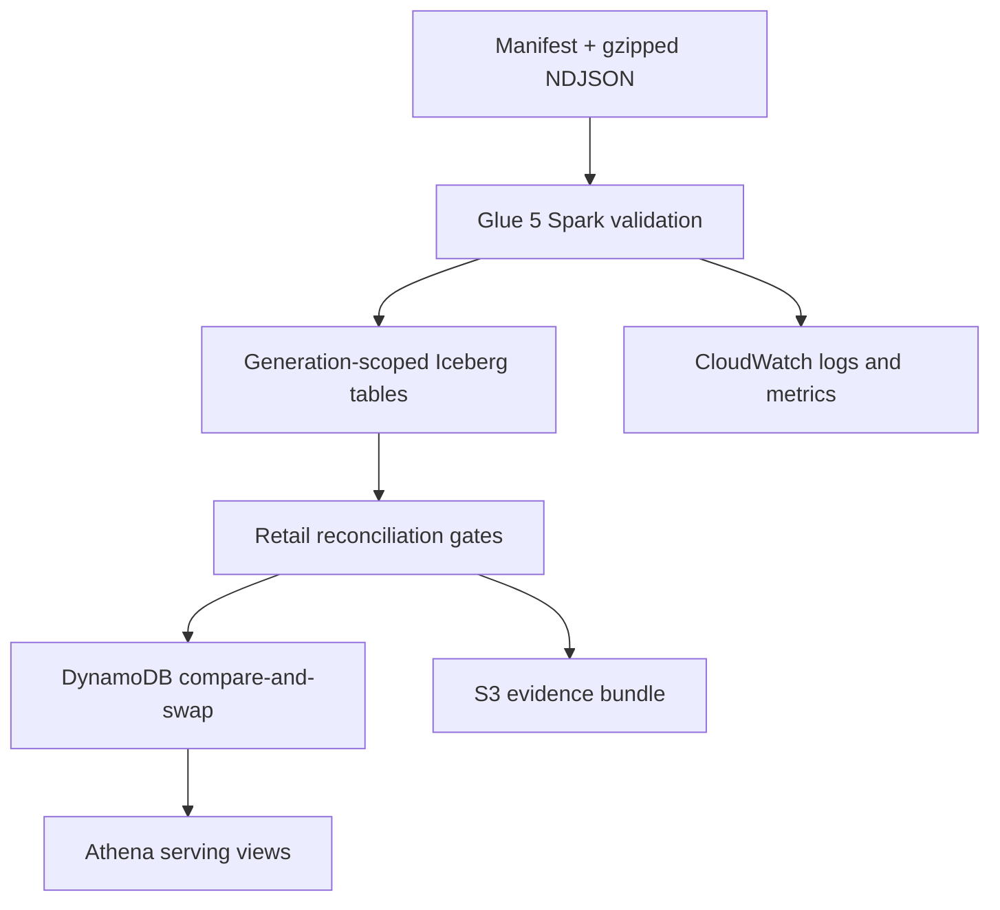

# Architecture

AtlasRetail is a bounded proof of a production lakehouse control plane. It separates immutable
input identity, generation-scoped transformation, quality gates, and publication. A failed or
backfill generation cannot silently replace the serving view.

## Correctness boundaries

| Boundary | Enforced invariant | Failure behaviour |
|---|---|---|
| Ingestion | A batch ID maps to one manifest digest | Conflicting replay is quarantined |
| Transform | Writes are generation scoped | Incomplete generation is not visible |
| Retail | Order, payment, refund and inventory equations balance | Step Functions execution fails |
| Dimension | Product version is knowable at event time | Missing/late version is quarantined |
| Publication | Active generation changes with compare-and-swap | Stale publisher loses safely |
| Recovery | Same manifest produces same logical result | Replay returns the existing generation |

## Deliberate scope

This repository proves correctness and bounded operation; it does not claim multi-region disaster
recovery, continuous petabyte throughput, PCI compliance, or a staffed 24x7 service. The AWS lab
uses small synthetic input, serverless services, deterministic run IDs, and an automatic teardown.

## Why Iceberg

Iceberg provides snapshot isolation, schema evolution, partition evolution, and time travel. The
project still adds a separate publication pointer because a consistent table snapshot is not the
same as a consistent multi-table retail generation. Publication is a control-plane decision made
only after cross-table reconciliation succeeds.
