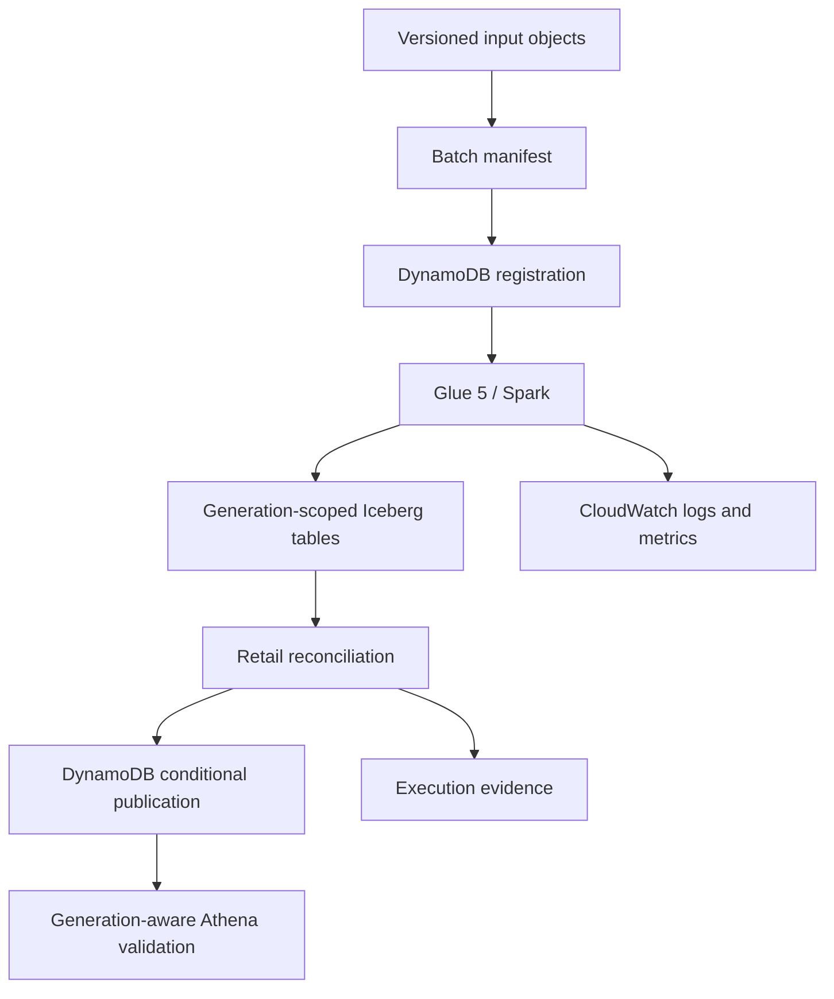

# Architecture

AtlasRetail separates input identity, transformation, business validation, and publication. The
separation allows an incomplete generation to exist physically without becoming the active retail
state.

## Data plane

S3 stores synthetic source objects and Iceberg warehouse data. The `retail-v2` manifest binds each
dataset to an exact S3 key, version, size, ETag, and SHA-256 checksum. The uploader verifies every
ordered table digest before issuing any S3 write. Glue independently replays the same canonical
digest from each registered object version, verifies object attributes, copies those exact versions
into a generation-isolated read prefix, applies Spark validation, and writes rows with the
registration-owned generation identifier. Athena executes generation-pinned queries through a
workgroup with a scan cutoff.

## Control plane

DynamoDB atomically creates the immutable batch identity and its generation record. Conditional
transitions enforce `REGISTERED -> BUILDING -> VALIDATED -> PUBLISHED` or `FAILED`. Publication is
a transaction that requires `VALIDATED`, advances the active pointer with compare-and-swap, and
marks the generation published. Step Functions routes managed failures into the lifecycle record.
CloudWatch captures workflow, Lambda, and Glue signals.

## Correctness boundaries

| Boundary | Invariant | Failure behaviour |
|---|---|---|
| Ingestion | A batch ID maps to one manifest digest | Conflicting reuse is rejected |
| Transform | Writes are generation scoped | Partial data remains inactive |
| Retail | Financial, return, inventory, and temporal rules pass | Publication does not run |
| Publication | The active pointer changes conditionally | A stale publisher fails |
| Replay | A published identity has one business effect | No second logical generation is created |
| Recovery | The accepted identity and generation remain stable | The same generation is rebuilt |

The local kernel and Glue transformation expose the same business failure codes. A parity test
compares their emitted codes directly, and the pinned Glue 5-compatible runtime executes the Spark
rules and real Iceberg writes in an isolated local catalog. See
[the correctness model](correctness.md).

## Why Iceberg is not the publication authority

Iceberg makes an individual table snapshot atomic. It does not make six separate table commits one
retail transaction. A generation therefore remains inactive until cross-table reconciliation
succeeds and the control-plane pointer advances. The alternatives and consequences are recorded in
[ADR 0001](adr/0001-generation-publication.md).

## Serving boundary

The active pointer is implemented in DynamoDB. The control Lambda resolves it with a consistent
read and returns the generation, pointer version, and validation digest. The serving module builds
one six-table Athena query from that single resolution. Direct physical-table access can still
bypass the resolver, so IAM separation remains necessary for a protected production interface.

## Deployment boundary

The AWS environment is ephemeral and run-tagged. GitHub Actions obtains short-lived credentials
through OIDC, validates a saved create-only plan, records teardown authority before apply, and uses
an independent job to validate and apply a saved destroy-only plan. Account and region checks,
resource ceilings, an account lease, and explicit absence checks limit the blast radius.

## Scope

The implementation targets a single AWS region and synthetic retail data. Multi-region recovery,
regulated customer data, sustained high-volume operation, and a staffed service lifecycle are not
part of the current implementation.
