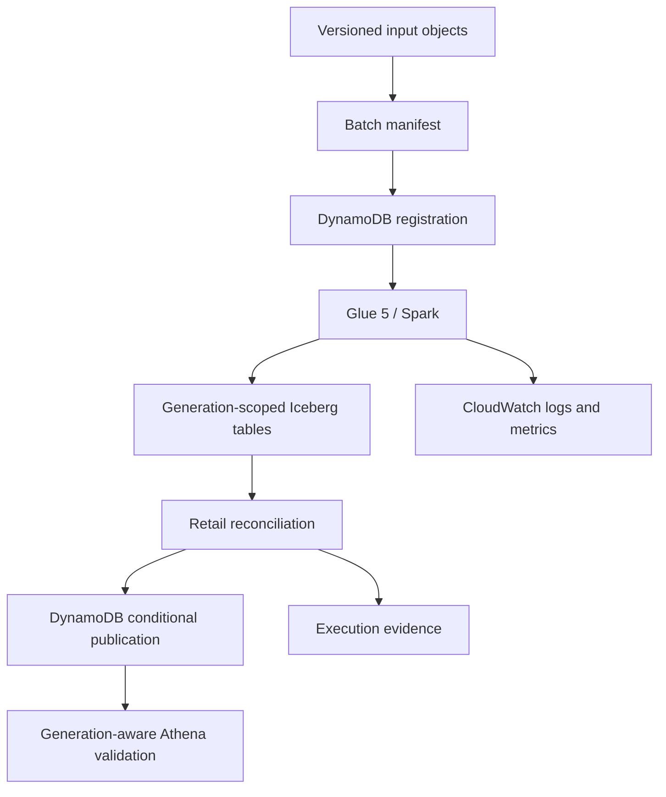

# Architecture

AtlasRetail separates input identity, transformation, business validation, and publication. The
separation allows an incomplete generation to exist physically without becoming the active retail
state.

## Data plane

S3 stores synthetic source objects and Iceberg warehouse data. Glue 5 reads the manifest and six
retail datasets, applies Spark validation, and writes rows with a generation identifier. Athena
executes bounded validation queries through a workgroup with a scan cutoff.

## Control plane

DynamoDB records the first accepted identity for each batch. After the transformation and
reconciliation succeed, a transactional compare-and-swap advances the active-generation pointer
and marks the batch published. Step Functions coordinates registration, transformation, and
publication. CloudWatch captures workflow, Lambda, and Glue signals.

## Correctness boundaries

| Boundary | Invariant | Failure behaviour |
|---|---|---|
| Ingestion | A batch ID maps to one manifest digest | Conflicting reuse is rejected |
| Transform | Writes are generation scoped | Partial data remains inactive |
| Retail | Financial, return, inventory, and temporal rules pass | Publication does not run |
| Publication | The active pointer changes conditionally | A stale publisher fails |
| Replay | A published identity has one business effect | No second logical generation is created |
| Recovery | The accepted identity and generation remain stable | The same generation is rebuilt |

See [the correctness model](correctness.md) for known differences between the local and managed
paths.

## Why Iceberg is not the publication authority

Iceberg makes an individual table snapshot atomic. It does not make six separate table commits one
retail transaction. A generation therefore remains inactive until cross-table reconciliation
succeeds and the control-plane pointer advances. The alternatives and consequences are recorded in
[ADR 0001](adr/0001-generation-publication.md).

## Serving boundary

The active pointer is implemented in DynamoDB. The current AWS workflow uses Athena for exact
post-run validation, not as a fully protected analyst interface. A generation-aware query resolver
is required before consumers can be prevented from querying physical tables without the active
generation filter.

## Deployment boundary

The AWS environment is ephemeral and run-tagged. GitHub Actions obtains short-lived credentials
through OIDC, validates a saved create-only plan, records teardown authority before apply, and uses
an independent job to validate and apply a saved destroy-only plan. Account and region checks,
resource ceilings, an account lease, and explicit absence checks limit the blast radius.

## Scope

The implementation targets a single AWS region and synthetic retail data. Multi-region recovery,
regulated customer data, sustained high-volume operation, and a staffed service lifecycle are not
part of the current implementation.
